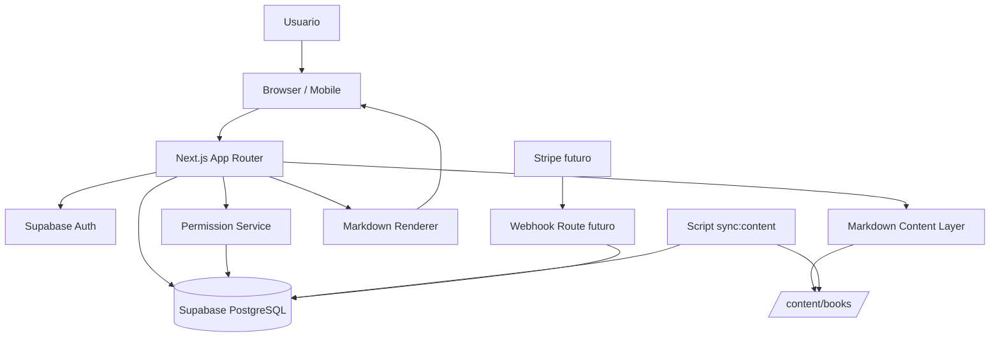
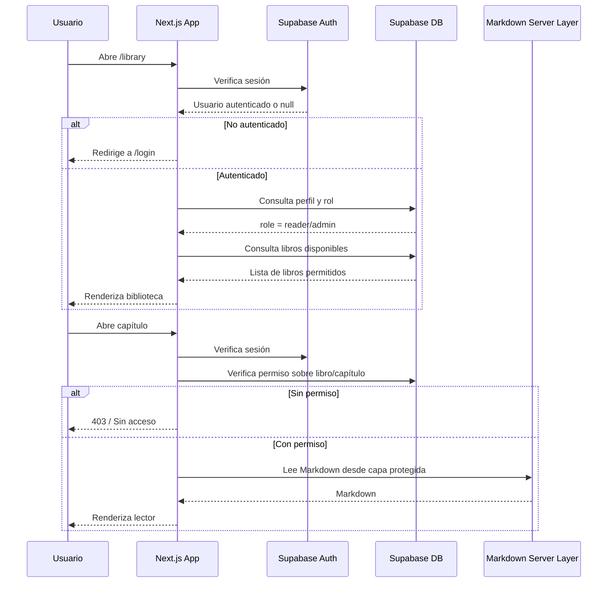
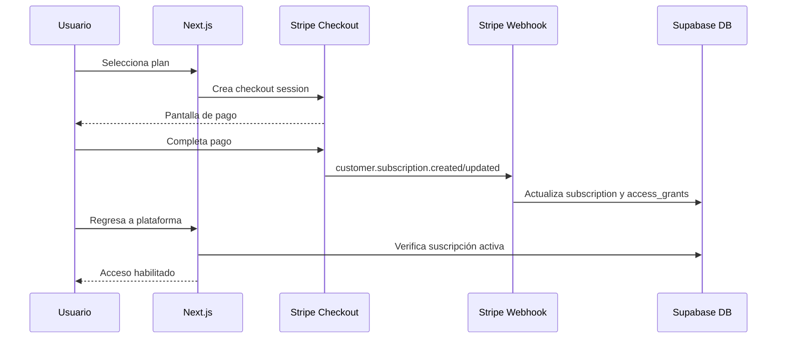
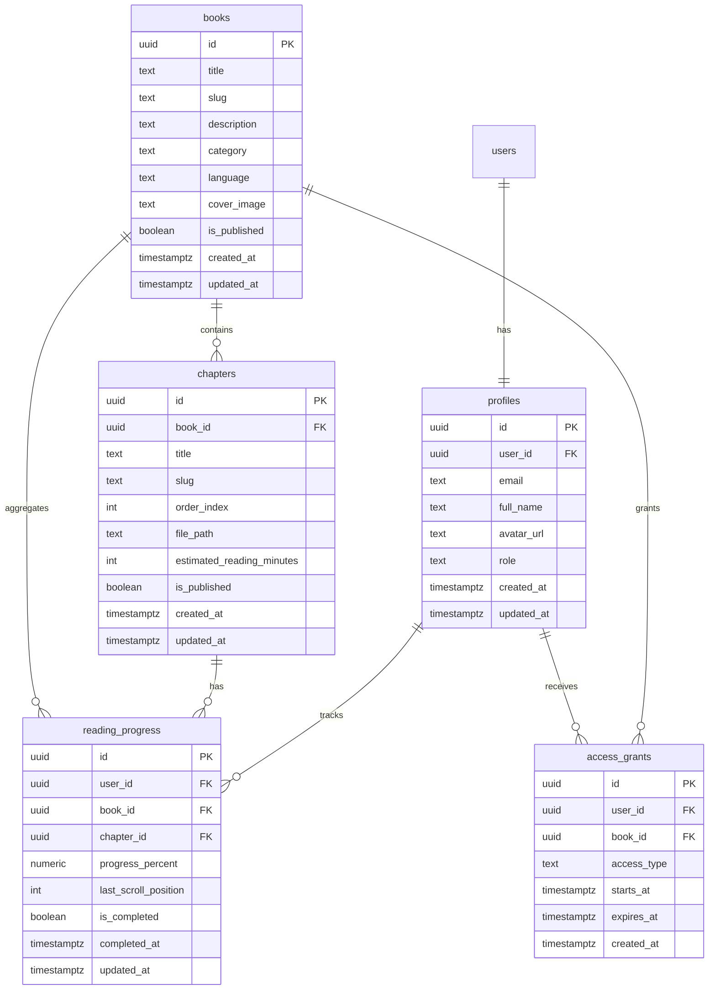
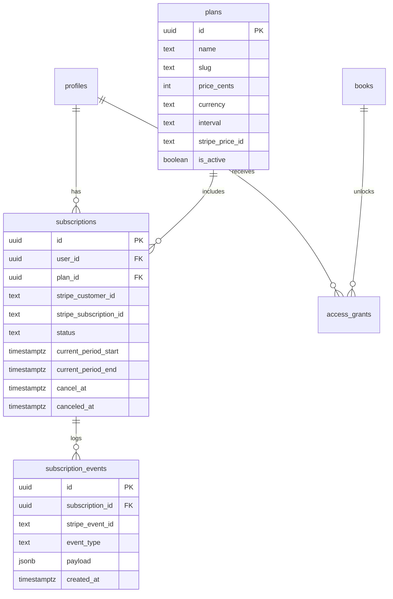

# Documento técnico-producto: MVP escalable para plataforma privada de lectura Markdown

## 1. Resumen ejecutivo

El objetivo es construir un MVP profesional de una plataforma web privada para leer notebooks/libros en Markdown desde laptop y móvil, con autenticación, autorización, biblioteca organizada, lector cómodo, progreso de lectura y una arquitectura preparada para evolucionar rápidamente hacia suscripciones, pagos, contenido licenciado y escalabilidad operativa.

La primera versión no debe construirse como una simple página estática. Debe construirse como una base SaaS mínima, aunque el uso inicial sea privado. Esto significa que desde el día uno se deben cuidar estos cimientos:

* Autenticación real.
* Autorización por roles/permisos.
* Base de datos en Supabase/PostgreSQL.
* Row Level Security cuando aplique.
* Contenido Markdown protegido.
* Modelo de datos extensible.
* Separación clara entre contenido, usuarios, progreso, acceso y futuras suscripciones.
* Código mantenible con TypeScript.
* UX responsive y mobile-first.
* Roadmap claro para pagos.

## 2. Principio estratégico

La decisión central es construir primero un MVP privado, pero con arquitectura de producto.

No se debe desarrollar como:

> “Una web bonita para abrir Markdown.”

Se debe desarrollar como:

> “Una plataforma privada de aprendizaje y lectura de contenido Markdown, con base SaaS, seguridad, progreso por usuario y preparación para monetización futura mediante contenido legalmente licenciado.”

Esta diferencia cambia la arquitectura. Una web estática sería rápida, pero difícil de escalar. Una base SaaS mínima toma más cuidado al inicio, pero evita rehacer todo cuando se agreguen pagos, planes, más usuarios o panel admin.

## 3. Alcance del MVP

### 3.1 Objetivo del MVP

Crear una plataforma funcional donde usuarios autorizados puedan iniciar sesión, ver una biblioteca de notebooks/libros cargados desde Markdown, leer capítulos desde celular o laptop, guardar progreso y tener una experiencia visual profesional.

### 3.2 Usuarios iniciales

* Admin: persona que gestiona contenido, usuarios y configuración.
* Reader: usuario autorizado para leer contenido.

En el MVP pueden ser solo 1 o 2 usuarios, pero el modelo debe soportar más usuarios después.

### 3.3 Funcionalidades incluidas

#### Autenticación

* Login con Supabase Auth.
* OAuth con Google como proveedor inicial.
* Sesión persistente.
* Rutas protegidas.

#### Autorización

* Roles básicos: `admin` y `reader`.
* Allowlist opcional por correo para MVP privado.
* Validación de acceso en servidor antes de entregar contenido.

#### Biblioteca

* Página principal con lista de libros/notebooks.
* Filtros por categoría, idioma o estado.
* Tarjetas con título, descripción, número de capítulos, progreso y último acceso.

#### Lector Markdown

* Renderizado de Markdown.
* Diseño responsive.
* Modo oscuro y claro.
* Control de tamaño de fuente.
* Tabla de contenidos por encabezados.
* Navegación capítulo anterior / siguiente.
* Barra de progreso.
* Estimación de tiempo de lectura.

#### Progreso de lectura

* Guardar último capítulo abierto.
* Guardar porcentaje de avance.
* Marcar capítulo como completado.
* Mostrar progreso por libro.

#### Panel admin mínimo

* Ver libros sincronizados.
* Ver capítulos detectados.
* Publicar/ocultar libro.
* Publicar/ocultar capítulo.
* Ver usuarios básicos.

#### Preparación para pagos

* Modelo de datos listo para planes y suscripciones.
* Separación de `access_grants` para permitir acceso manual hoy y acceso por suscripción mañana.
* Webhooks Stripe previstos en arquitectura, aunque no se implementen en MVP.

## 4. Fuera del alcance del MVP

No incluir en la primera versión:

* Stripe completamente funcional.
* Marketplace.
* Sistema de referidos.
* Wallet login.
* App móvil nativa.
* IA sobre los libros.
* Chatbot con RAG.
* Comunidad.
* DRM avanzado.
* Subida masiva desde interfaz web.
* Editor Markdown en línea.

Estos elementos se dejan preparados por arquitectura, pero no se desarrollan todavía.

## 5. Stack técnico recomendado

### 5.1 Frontend

* Next.js con App Router.
* TypeScript.
* Tailwind CSS.
* shadcn/ui.
* Lucide React para iconos.
* React Markdown o MDX pipeline.

### 5.2 Backend

* Next.js Server Components.
* Next.js Route Handlers.
* Server Actions donde tenga sentido.
* Validaciones del lado servidor.

### 5.3 Base de datos y Auth

* Supabase.
* PostgreSQL.
* Supabase Auth.
* Row Level Security en tablas con datos de usuario.

### 5.4 Storage / contenido

Para MVP:

* Markdown en carpeta privada del repositorio: `/content/books`.
* Metadatos por libro en JSON o YAML.
* Sincronización hacia Supabase mediante script.

Para fase futura:

* Supabase Storage privado o S3/R2.
* Contenido versionado.
* Carga desde panel admin.

### 5.5 Deploy

* Vercel para la app Next.js.
* Supabase para base de datos y auth.
* Variables de entorno en Vercel.

## 6. Decisión importante: Docusaurus vs Next.js

Docusaurus sirve muy bien para documentación pública o semi-estática. Sin embargo, no es la mejor base para este proyecto porque la visión futura incluye:

* Usuarios.
* Roles.
* Progreso individual.
* Contenido protegido.
* Planes.
* Pagos.
* Administración.
* Posible personalización por usuario.

Por eso, la recomendación es usar Next.js. Permite construir la experiencia de lectura y al mismo tiempo manejar backend, auth, permisos y rutas protegidas.

## 7. Arquitectura general



## 8. Flujo de autenticación y autorización



## 9. Flujo futuro de pagos



## 10. Estructura de carpetas recomendada

```txt
secure-markdown-reader/
  app/
    (auth)/
      login/
        page.tsx
    (dashboard)/
      layout.tsx
      library/
        page.tsx
      books/
        [bookSlug]/
          page.tsx
          chapters/
            [chapterSlug]/
              page.tsx
      progress/
        page.tsx
      settings/
        page.tsx
      admin/
        page.tsx
        books/
          page.tsx
        users/
          page.tsx
    api/
      auth/
      progress/
      content-sync/
      webhooks/
        stripe/
          route.ts

  components/
    reader/
      markdown-reader.tsx
      reading-progress-bar.tsx
      chapter-navigation.tsx
      table-of-contents.tsx
      reader-settings.tsx
    library/
      book-card.tsx
      category-filter.tsx
      continue-reading-card.tsx
    admin/
      admin-book-table.tsx
      admin-user-table.tsx
    layout/
      app-sidebar.tsx
      topbar.tsx
      mobile-nav.tsx
    ui/

  content/
    books/
      financial-analysis/
        book.json
        01-introduction.md
        02-financial-statements.md
      trading-strategies/
        book.json
        01-introduction.md

  lib/
    supabase/
      client.ts
      server.ts
      middleware.ts
      admin.ts
    auth/
      get-current-user.ts
      require-user.ts
      require-admin.ts
    content/
      get-books.ts
      get-book.ts
      get-chapter.ts
      parse-markdown.ts
      sync-content.ts
    permissions/
      can-access-book.ts
      can-access-chapter.ts
    progress/
      update-progress.ts
      calculate-book-progress.ts
    utils/
      reading-time.ts
      slugify.ts

  scripts/
    sync-content.ts
    validate-content.ts

  supabase/
    migrations/
      001_initial_schema.sql
      002_rls_policies.sql
      003_seed_roles.sql

  types/
    database.types.ts
```

## 11. Estructura del contenido Markdown

Cada libro debe tener su propia carpeta.

```txt
content/books/
  book-slug/
    book.json
    01-chapter-title.md
    02-chapter-title.md
```

Ejemplo de `book.json`:

```json
{
  "title": "Financial Analysis Notebook",
  "slug": "financial-analysis-notebook",
  "description": "Notebook de análisis financiero y fundamentos de inversión.",
  "category": "Finance",
  "language": "es",
  "coverImage": null,
  "isPublished": true,
  "chapters": [
    {
      "title": "Introducción al análisis financiero",
      "slug": "introduccion-analisis-financiero",
      "file": "01-introduccion.md",
      "order": 1,
      "isPublished": true
    }
  ]
}
```

Reglas para contenido:

* No guardar Markdown premium en `/public`.
* No exponer rutas directas a archivos Markdown.
* Leer archivos desde servidor.
* Validar sesión y permiso antes de renderizar.
* Mantener metadatos consistentes.
* Usar slugs estables.
* Evitar nombres de archivos con espacios o caracteres raros.

## 12. Modelo de datos MVP

### 12.1 Diagrama entidad-relación



### 12.2 Tablas MVP

#### profiles

Extiende `auth.users` sin modificar directamente la tabla interna de Supabase.

Campos:

* `id uuid primary key`
* `user_id uuid references auth.users(id)`
* `email text unique not null`
* `full_name text`
* `avatar_url text`
* `role text not null default 'reader'`
* `created_at timestamptz default now()`
* `updated_at timestamptz default now()`

Roles iniciales:

* `admin`
* `reader`

#### books

Representa cada libro/notebook.

Campos:

* `id uuid primary key`
* `title text not null`
* `slug text unique not null`
* `description text`
* `category text`
* `language text default 'es'`
* `cover_image text`
* `is_published boolean default false`
* `created_at timestamptz default now()`
* `updated_at timestamptz default now()`

#### chapters

Representa capítulos asociados a un libro.

Campos:

* `id uuid primary key`
* `book_id uuid references books(id)`
* `title text not null`
* `slug text not null`
* `order_index int not null`
* `file_path text not null`
* `estimated_reading_minutes int`
* `is_published boolean default false`
* `created_at timestamptz default now()`
* `updated_at timestamptz default now()`

Índice único recomendado:

* `(book_id, slug)`
* `(book_id, order_index)`

#### reading_progress

Guarda progreso individual por usuario.

Campos:

* `id uuid primary key`
* `user_id uuid references profiles(id)`
* `book_id uuid references books(id)`
* `chapter_id uuid references chapters(id)`
* `progress_percent numeric default 0`
* `last_scroll_position int default 0`
* `is_completed boolean default false`
* `completed_at timestamptz`
* `updated_at timestamptz default now()`

Índice único:

* `(user_id, chapter_id)`

#### access_grants

Clave para escalar a pagos después. Hoy se puede usar para dar acceso manual. Mañana se puede alimentar desde Stripe.

Campos:

* `id uuid primary key`
* `user_id uuid references profiles(id)`
* `book_id uuid references books(id)`
* `access_type text not null`
* `starts_at timestamptz default now()`
* `expires_at timestamptz`
* `created_at timestamptz default now()`

Valores sugeridos para `access_type`:

* `manual`
* `admin`
* `subscription`
* `trial`

## 13. Modelo de datos preparado para pagos futuros

No se implementa en MVP, pero se deja previsto.



Tablas futuras:

* `plans`
* `subscriptions`
* `subscription_events`
* `invoices` opcional
* `payments` opcional

Regla futura:

> Stripe será la fuente de verdad para pagos; Supabase guardará una copia del estado necesario para autorizar acceso.

## 14. Seguridad y políticas

### 14.1 Principios de seguridad

* Nunca confiar en el frontend para autorizar contenido.
* Validar sesión en servidor.
* Validar permiso antes de leer Markdown.
* No poner Markdown privado en `/public`.
* Usar RLS en tablas con datos por usuario.
* Usar Service Role Key solo en entorno servidor y nunca exponerla al cliente.
* Separar cliente público de cliente admin.
* Mantener webhooks firmados cuando llegue Stripe.

### 14.2 Row Level Security sugerido

Tablas con RLS:

* `profiles`
* `reading_progress`
* `access_grants`
* `subscriptions` en fase futura

Tablas que pueden ser lectura pública solo si no exponen contenido sensible:

* `books`
* `chapters`

Pero para MVP privado, incluso `books` y `chapters` pueden requerir usuario autenticado.

### 14.3 Políticas conceptuales

#### profiles

* Usuario puede leer su propio profile.
* Admin puede leer todos los profiles.
* Usuario puede actualizar ciertos campos propios.
* Solo admin puede cambiar roles.

#### reading_progress

* Usuario puede leer su propio progreso.
* Usuario puede crear/actualizar su propio progreso.
* Admin puede leer todo.

#### access_grants

* Usuario puede leer sus propios accesos.
* Admin puede gestionar todos los accesos.
* Usuario no puede crear accesos para sí mismo.

## 15. Lógica de permisos

Debe existir una función centralizada:

```ts
canAccessBook(userId: string, bookId: string): Promise<boolean>
```

Reglas MVP:

1. Si usuario es admin, tiene acceso.
2. Si libro no está publicado, solo admin.
3. Si usuario tiene `access_grant` activo para ese libro, tiene acceso.
4. Si el modo MVP privado está activo y el usuario está en allowlist, tiene acceso.
5. Si no cumple, no tiene acceso.

Reglas futuras:

1. Si suscripción activa desbloquea todos los libros, crear acceso global o resolver por plan.
2. Si plan solo desbloquea categorías, validar por categoría.
3. Si libro es gratuito, permitir a autenticados.

## 16. UX/UI MVP

### 16.1 Pantallas principales

#### Login

* Logo.
* Frase breve.
* Botón “Continuar con Google”.
* Mensaje de acceso privado.

#### Dashboard / Library

Elementos:

* Saludo.
* Card de “Continuar leyendo”.
* Lista de libros.
* Filtros por categoría.
* Progreso global.

#### Book detail

Elementos:

* Título.
* Descripción.
* Categoría.
* Progreso del libro.
* Lista de capítulos.
* Estado de cada capítulo.

#### Chapter reader

Elementos:

* Contenido Markdown.
* Barra de progreso.
* Tabla de contenidos.
* Botón anterior/siguiente.
* Configuración de fuente.
* Tema claro/oscuro.
* Botón marcar como completado.

#### Admin

Elementos:

* Tabla de libros.
* Tabla de capítulos.
* Estado publicado/no publicado.
* Usuarios.
* Accesos manuales.

### 16.2 Principios visuales

* Mobile-first.
* Lectura cómoda.
* Alto contraste.
* Tipografía limpia.
* Pocos elementos distractores.
* Transiciones sutiles.
* Apariencia premium/fintech.

### 16.3 Paleta inicial sugerida

```txt
Background dark: #0B1020
Surface: #111827
Surface elevated: #1F2937
Primary text: #F9FAFB
Secondary text: #9CA3AF
Accent green: #22C55E
Accent blue: #38BDF8
Warning: #F59E0B
Danger: #EF4444
```

## 17. Gamificación posterior

No implementarla toda en el MVP, pero diseñar el progreso pensando en ella.

Fase posterior:

* Puntos por capítulo completado.
* Rachas de lectura.
* Logros.
* Niveles.
* Estadísticas semanales.
* Objetivos personales.

Tablas futuras:

* `achievements`
* `user_achievements`
* `reading_sessions`
* `user_streaks`

## 18. Plan de implementación paso a paso

### Fase 0: Preparación

Objetivo: ordenar contenido y definir reglas.

Tareas:

1. Recolectar los 12-18 archivos Markdown.
2. Definir si cada archivo es libro o capítulo.
3. Normalizar nombres.
4. Crear estructura `/content/books`.
5. Crear `book.json` por libro.
6. Validar que el Markdown renderiza bien.
7. Identificar imágenes, tablas, fórmulas o bloques especiales.
8. Definir usuarios iniciales.
9. Definir proveedor OAuth inicial.
10. Confirmar que monetización futura solo ocurrirá con licencias apropiadas.

Entregable:

* Carpeta de contenido organizada.
* Documento de estructura de libros.

### Fase 1: Setup técnico

Tareas:

1. Crear app Next.js.
2. Instalar Tailwind.
3. Configurar shadcn/ui.
4. Configurar Supabase client/server.
5. Configurar variables de entorno.
6. Configurar Supabase Auth.
7. Crear layout base.
8. Crear rutas protegidas.

Entregable:

* App base con login funcional.

### Fase 2: Base de datos

Tareas:

1. Crear migraciones SQL.
2. Crear tablas `profiles`, `books`, `chapters`, `reading_progress`, `access_grants`.
3. Activar RLS.
4. Crear policies.
5. Crear trigger para profile al registrarse usuario.
6. Crear seed admin.

Entregable:

* Base de datos lista para usuarios, libros, progreso y accesos.

### Fase 3: Capa de contenido

Tareas:

1. Crear parser de `book.json`.
2. Crear función `getBooks()`.
3. Crear función `getBookBySlug()`.
4. Crear función `getChapterBySlug()`.
5. Crear cálculo de reading time.
6. Crear script `sync-content`.
7. Sincronizar libros/capítulos con Supabase.

Entregable:

* Los Markdown aparecen como libros/capítulos en la DB.

### Fase 4: Biblioteca

Tareas:

1. Crear página `/library`.
2. Crear cards de libros.
3. Crear filtros.
4. Mostrar progreso por libro.
5. Mostrar “continuar leyendo”.

Entregable:

* Biblioteca usable.

### Fase 5: Lector

Tareas:

1. Crear ruta de capítulo.
2. Validar permisos en servidor.
3. Leer Markdown protegido.
4. Renderizar contenido.
5. Agregar tabla de contenidos.
6. Agregar navegación anterior/siguiente.
7. Agregar progreso visual.
8. Guardar progreso.

Entregable:

* Lector completo responsive.

### Fase 6: Admin MVP

Tareas:

1. Crear layout admin.
2. Proteger rutas admin.
3. Tabla de libros.
4. Tabla de capítulos.
5. Gestión de estado published/unpublished.
6. Gestión básica de usuarios.
7. Gestión básica de accesos manuales.

Entregable:

* Admin básico funcional.

### Fase 7: Hardening

Tareas:

1. Revisar permisos.
2. Revisar RLS.
3. Validar que Markdown no sea público.
4. Revisar variables de entorno.
5. Probar mobile.
6. Probar usuarios sin acceso.
7. Probar usuario admin.
8. Probar usuario reader.
9. Manejar errores 401/403/404.
10. Crear README técnico.

Entregable:

* MVP listo para demo privada.

## 19. Ingeniería de prompt: metodología de trabajo con IA

La IA no debe recibir instrucciones genéricas como:

> “Hazme una plataforma para leer Markdown.”

Debe recibir tareas pequeñas, verificables y secuenciales. Cada prompt debe incluir:

* Contexto del proyecto.
* Objetivo de la tarea.
* Archivos involucrados.
* Restricciones técnicas.
* Criterios de aceptación.
* Qué no debe modificar.
* Resultado esperado.

## 20. Prompt maestro del proyecto

Usar este prompt al iniciar una sesión de desarrollo con IA:

```txt
Actúa como un senior full-stack engineer especializado en Next.js App Router, TypeScript, Supabase, PostgreSQL, RLS, Tailwind CSS y arquitectura SaaS.

Estoy construyendo un MVP privado para una plataforma de lectura de libros/notebooks en Markdown. El objetivo es que usuarios autorizados puedan iniciar sesión, ver una biblioteca, leer capítulos Markdown protegidos, guardar progreso y que la arquitectura quede preparada para integrar pagos con Stripe en una fase futura.

Stack obligatorio:
- Next.js App Router
- TypeScript
- Supabase Auth
- Supabase PostgreSQL
- Supabase RLS
- Tailwind CSS
- shadcn/ui
- Markdown/MDX rendering

Principios obligatorios:
- No exponer contenido Markdown privado en /public.
- Validar sesión y permisos en servidor antes de entregar contenido.
- Usar una estructura limpia por dominios: auth, content, permissions, progress, admin.
- Mantener código tipado y legible.
- No introducir dependencias innecesarias.
- Diseñar pensando en pagos futuros, pero no implementarlos todavía.

Antes de escribir código, dame un plan corto de cambios y lista los archivos que vas a crear o modificar. Después implementa solo la tarea solicitada. Al final, dame checklist de criterios de aceptación y cómo probarlo.
```

## 21. Prompts por fase

### 21.1 Prompt para crear estructura del proyecto

```txt
Necesito crear la estructura inicial del proyecto Next.js App Router para la plataforma de lectura Markdown.

Crea una arquitectura de carpetas profesional con:
- app/(auth)/login
- app/(dashboard)/library
- app/(dashboard)/books/[bookSlug]/chapters/[chapterSlug]
- app/(dashboard)/admin
- components/reader
- components/library
- components/admin
- lib/supabase
- lib/auth
- lib/content
- lib/permissions
- lib/progress
- content/books
- scripts
- supabase/migrations

No implementes todavía lógica compleja. Solo crea estructura, archivos placeholder mínimos y convenciones de nombres. Usa TypeScript.

Criterios de aceptación:
- El proyecto compila.
- Las rutas existen.
- No hay lógica falsa o mockeada innecesaria.
- La estructura queda lista para Supabase y Markdown.
```

### 21.2 Prompt para configurar Supabase

```txt
Configura Supabase en este proyecto Next.js App Router.

Necesito:
- Cliente Supabase para browser.
- Cliente Supabase para server components/route handlers.
- Middleware para refrescar sesión.
- Variables de entorno documentadas.
- Helpers requireUser y getCurrentUser.

Restricciones:
- No expongas service role key al cliente.
- Usa @supabase/ssr si aplica.
- Todo debe estar tipado.
- No implementes UI todavía.

Criterios de aceptación:
- Puedo obtener la sesión en servidor.
- Puedo proteger una ruta dashboard.
- El proyecto compila sin errores TypeScript.
```

### 21.3 Prompt para migraciones SQL

```txt
Crea las migraciones SQL iniciales para Supabase/PostgreSQL.

Tablas requeridas:
- profiles
- books
- chapters
- reading_progress
- access_grants

Incluye:
- UUID primary keys.
- Timestamps.
- Foreign keys.
- Índices necesarios.
- Unique constraints.
- updated_at trigger.
- RLS habilitado.
- Policies básicas para usuario y admin.

Roles iniciales:
- admin
- reader

Restricciones:
- No modificar auth.users directamente salvo referencias.
- profiles debe extender auth.users.
- Usuarios normales solo pueden leer/editar su propio progreso.
- Solo admin puede gestionar access_grants.

Criterios de aceptación:
- Las migraciones corren en Supabase.
- RLS queda activo.
- Usuario reader no puede leer datos de otro usuario.
- Admin puede gestionar contenido y accesos.
```

### 21.4 Prompt para sincronizar contenido Markdown

```txt
Implementa un sistema de sincronización de contenido Markdown.

Contexto:
Los libros están en /content/books/[bookSlug]/book.json y cada capítulo es un archivo .md.

Necesito:
- Script scripts/sync-content.ts.
- Validación de book.json.
- Cálculo de estimated_reading_minutes.
- Upsert de books y chapters en Supabase.
- Reporte en consola de libros/capítulos sincronizados.

Restricciones:
- No subir el contenido Markdown completo a la DB por ahora.
- Guardar solo metadata y file_path.
- Si cambia un título o descripción, actualizar DB.
- Si falta un archivo mencionado en book.json, lanzar error claro.

Criterios de aceptación:
- Al correr pnpm sync:content se actualizan books y chapters.
- No se duplican registros.
- Los slugs permanecen estables.
- Los errores de estructura son entendibles.
```

### 21.5 Prompt para biblioteca

```txt
Construye la página /library para la plataforma.

Debe:
- Requerir usuario autenticado.
- Consultar libros publicados y accesibles.
- Mostrar cards de libros.
- Mostrar progreso por libro si existe.
- Mostrar una sección 'Continuar leyendo'.
- Ser responsive y mobile-first.
- Usar Tailwind y shadcn/ui.

Restricciones:
- No mostrar libros sin permiso.
- No consultar Supabase desde componentes cliente salvo que sea necesario.
- La validación de acceso debe ocurrir en servidor.

Criterios de aceptación:
- Usuario no logueado va a login.
- Usuario logueado ve solo libros permitidos.
- Diseño se ve bien en móvil y desktop.
```

### 21.6 Prompt para lector Markdown

```txt
Construye el lector de capítulos en /books/[bookSlug]/chapters/[chapterSlug].

Debe:
- Requerir usuario autenticado.
- Validar permiso del usuario sobre el libro/capítulo en servidor.
- Leer el archivo Markdown desde /content/books, no desde /public.
- Renderizar Markdown de forma segura.
- Mostrar título, progreso, tabla de contenidos y navegación anterior/siguiente.
- Permitir guardar progreso.
- Ser muy cómodo en móvil.

Restricciones:
- No exponer la ruta real del archivo Markdown al cliente.
- No renderizar HTML inseguro sin sanitización.
- No permitir acceso si el usuario no tiene grant o rol admin.

Criterios de aceptación:
- Si no tengo permiso, recibo 403.
- Si tengo permiso, leo el capítulo.
- El progreso se guarda correctamente.
- La navegación entre capítulos funciona.
```

### 21.7 Prompt para panel admin MVP

```txt
Construye un panel admin MVP.

Debe incluir:
- Ruta /admin protegida por rol admin.
- Lista de libros.
- Lista de capítulos por libro.
- Toggle published/unpublished.
- Lista básica de usuarios.
- Gestión básica de access_grants manuales.

Restricciones:
- Ningún reader puede acceder a /admin.
- Toda acción de admin debe validarse en servidor.
- No crear un CMS complejo todavía.

Criterios de aceptación:
- Admin entra a /admin.
- Reader recibe 403.
- Admin puede publicar/ocultar libros y capítulos.
- Admin puede dar acceso manual a un usuario.
```

### 21.8 Prompt para preparación de Stripe futura

```txt
Prepara la arquitectura para integrar Stripe en una fase futura, sin activar pagos todavía.

Necesito:
- Crear tipos y carpetas para billing.
- Crear tablas futuras como migración opcional o documentación SQL: plans, subscriptions, subscription_events.
- Crear archivo lib/billing/README.md explicando cómo se integrará Stripe.
- Crear placeholder seguro para app/api/webhooks/stripe/route.ts, sin lógica activa si no hay STRIPE_SECRET_KEY.

Restricciones:
- No implementar checkout todavía.
- No romper el MVP privado.
- No usar Stripe como dependencia si no se necesita aún.

Criterios de aceptación:
- El proyecto sigue funcionando sin Stripe.
- Queda claro dónde irá checkout, portal y webhook.
- La autorización actual por access_grants podrá conectarse después a subscriptions.
```

## 22. Checklist de calidad antes de entregar MVP

### Seguridad

* [ ] Markdown no está en `/public`.
* [ ] Rutas privadas requieren sesión.
* [ ] Rutas admin requieren rol admin.
* [ ] RLS activo en tablas sensibles.
* [ ] Service role key no está en cliente.
* [ ] Usuarios no pueden leer progreso de otros.
* [ ] Usuarios no pueden auto-otorgarse acceso.
* [ ] 401/403 manejados correctamente.

### Producto

* [ ] Login funciona.
* [ ] Biblioteca carga.
* [ ] Lector funciona en móvil.
* [ ] Progreso se guarda.
* [ ] Continuar leyendo funciona.
* [ ] Admin puede ver contenido.
* [ ] Admin puede otorgar acceso.

### Ingeniería

* [ ] TypeScript sin errores.
* [ ] Linter sin errores críticos.
* [ ] Componentes organizados.
* [ ] Funciones de permisos centralizadas.
* [ ] Migraciones versionadas.
* [ ] README con setup.
* [ ] Variables de entorno documentadas.

## 23. Variables de entorno esperadas

```env
NEXT_PUBLIC_SUPABASE_URL=
NEXT_PUBLIC_SUPABASE_ANON_KEY=
SUPABASE_SERVICE_ROLE_KEY=
NEXT_PUBLIC_APP_URL=http://localhost:3000

# Futuro Stripe
STRIPE_SECRET_KEY=
STRIPE_WEBHOOK_SECRET=
NEXT_PUBLIC_STRIPE_PUBLISHABLE_KEY=
```

Regla:

* `NEXT_PUBLIC_*` puede llegar al navegador.
* `SUPABASE_SERVICE_ROLE_KEY` jamás debe llegar al navegador.
* Stripe secret keys solo servidor.

## 24. Roadmap profesional

### Sprint 1: Base y auth

* Next.js setup.
* Supabase setup.
* Login.
* Rutas protegidas.
* Layout dashboard.

### Sprint 2: DB y contenido

* Migraciones.
* RLS.
* Estructura Markdown.
* Script sync-content.
* Biblioteca inicial.

### Sprint 3: Lector

* Render Markdown.
* Página capítulo.
* Progreso.
* Navegación.
* Responsive.

### Sprint 4: Admin y hardening

* Panel admin.
* Grants manuales.
* Publicar/ocultar.
* QA seguridad.
* README.

### Sprint 5 futuro: Monetización

* Stripe Checkout.
* Stripe Customer Portal.
* Webhooks.
* Planes.
* Subscriptions.
* Access grants automáticos.

## 25. Riesgos principales

### Riesgo legal

Monetizar libros escaneados requiere licencias explícitas. La plataforma debe estar lista técnicamente para pagos, pero no se debe vender acceso a contenido sin derechos.

### Riesgo de seguridad

Si el Markdown se sirve como archivo público, cualquier persona con URL podría acceder. Por eso el contenido debe pasar por una capa protegida del servidor.

### Riesgo de deuda técnica

Si se usa IA sin prompts específicos, generará código mezclado, rutas inseguras y componentes difíciles de mantener. La mitigación es trabajar por fases con prompts pequeños y criterios de aceptación.

### Riesgo de sobreconstrucción

Meter pagos, IA, gamificación y admin avanzado en el MVP puede retrasar todo. La estrategia correcta es base sólida + lector excelente + auth + progreso.

## 26. Definición de terminado del MVP

El MVP está terminado cuando:

1. Un usuario autorizado puede iniciar sesión.
2. Puede ver los libros disponibles.
3. Puede abrir un libro.
4. Puede leer capítulos Markdown en móvil y desktop.
5. Su progreso queda guardado.
6. Un admin puede publicar/ocultar contenido.
7. Un admin puede otorgar acceso manual.
8. Un usuario sin permiso no puede acceder al contenido.
9. El contenido Markdown no está expuesto públicamente.
10. La arquitectura permite agregar Stripe sin rehacer el sistema de acceso.

## 27. Conclusión técnica

La recomendación es construir el MVP con Next.js y Supabase, usando una arquitectura SaaS mínima desde el inicio. El contenido Markdown debe vivir inicialmente en una carpeta privada del proyecto y sincronizar metadata hacia Supabase. La autorización debe resolverse con roles y `access_grants`, no con condicionales visuales en el frontend.

La decisión más importante para escalar es esta:

> Todo acceso al contenido debe pasar por una función central de permisos.

Si esa regla se respeta desde el día uno, mañana se puede conectar Stripe, planes, trials o licencias sin rediseñar toda la aplicación.